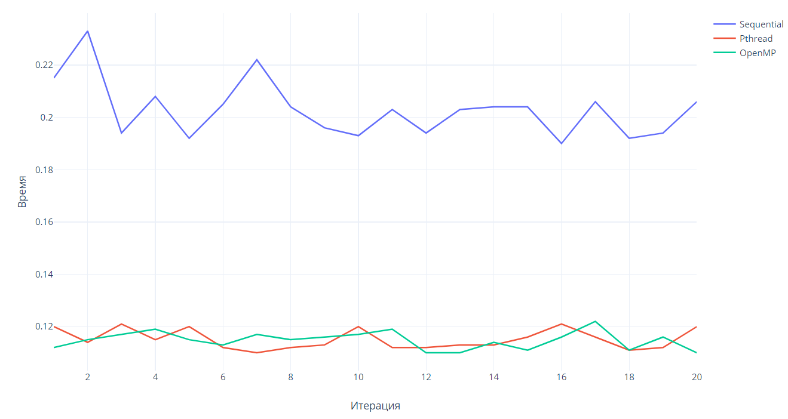

# Постановка задачи

## Индивидуальное задание

**Вариант 6, OpenMP**

Вершины дерева размечены числовыми значениями. Для каждой вершины рассчитать сумму чисел всех вершин, для которых данная
вершина является корнем.

## Программа работы

1. Разработка алгоритма для решения индивидуального задания;
2. Создание последовательной реализации алгоритма;
3. Создание тестовых наборов;
4. Распараллеливание алгоритма;
5. Разработка параллельной реализации с использованием Pthreads;
6. Разработка параллельной реализации с использованием OpenMP;
7. Измерение производительности, сравнение с производительностью последовательной программы;
8. Анализ полученных результатов.

# Разработка алгоритма для решения индивидуального задания

Для выполнения данного задания в качестве древовидной структуры было выбрано двоичное дерево.

Каждый узел дерева содержит следующие данные:

- значение, которым помечен узел;
- сумма всех узлов, для которых данный узел является корневым (0 по умолчанию);
- ссылка на левый дочерний узел (`NULL` по умолчанию);
- ссылка на правый дочерний узел (`NULL` по умолчанию).

В основе алгоритма для решения задачи был выбран алгоритм восходящей аккумуляции Гиббсона. Он заключается в том,
чтобы постепенно аккумулировать (суммировать) значения каждого узла и суммы его дочерних узлов в соответствующем поле
ближайшего общего родителя:

```c++
parent_node->child_sum = left_node->child_sum + left_child->value + right_node->child_sum + right_node->value
```

Алгоритм называется восходящим, т.к. аккумуляция начинается с листовых узлов, т.е. с тех, которые не имеют потомков и
по сути находятся внизу дерева.

# Создание последовательной реализации алгоритма

Структура узла дерева была реализована в виде класса `TreeNode`:

```c++
class TreeNode {
public:
    // Конструктор класса
    explicit TreeNode(int value) : value_(value) {}

    // Геттер значения узла
    int GetValue();

    // Геттер суммы всех узлов, для которых данный узел является корневым
    long long GetChildSum();

    // Геттер левого дочернего узла
    TreeNode *GetLeftNode();
    
    // Сеттеры левого дочернего узла 
    TreeNode *SetLeftNode(int value);
    TreeNode *SetLeftNode(TreeNode *node);
    
    // Геттер правого дочернего узла
    TreeNode *GetRightNode();
    
    // Сеттеры правого дочернего узла
    TreeNode *SetRightNode(int value);
    TreeNode *SetRightNode(TreeNode *node);

    // Аккумуляция дерева, для которого данный узел является корневым (последовательная реализация)
    void SumSequential();

private:
    int value_;
    long long child_sum_{};
    TreeNode *left_child_{};
    TreeNode *right_child_{};
    
    static long long SumSequentialRoutine(TreeNode *node);
};
```

Листинг 1. Класс `TreeNode`

Последовательная реализация алгоритма:

```c++
long long TreeNode::SumSequentialRoutine(TreeNode *node) {
    node->child_sum_ = 0;
    if (node->left_child_ != nullptr) {
        node->child_sum_ += SumSequentialRoutine(node->left_child_);
    }
    if (node->right_child_ != nullptr) {
        node->child_sum_ += SumSequentialRoutine(node->right_child_);
    }
    return node->child_sum_ + node->value_;
}

void TreeNode::SumSequential() {
    SumSequentialRoutine(this);
}
```

Листинг 2. Последовательная реализация алгоритма

# Создание тестовых наборов

Для создания тестовых наборов была реализована утилита для генерации симметричного бинарного дерева с заданной глубиной
и случайными значениями:

```c++
const int min_node_value = 0;
const int max_node_value = 100;

TreeNode *GenerateRandomTree(int max_depth) {
    if (max_depth < 1) {
        printf("Invalid tree parameters\n");
        return nullptr;
    }

    std::random_device random_seed;
    std::default_random_engine random_generator(random_seed());
    std::uniform_int_distribution<int> value_generator(min_node_value, max_node_value);

    int node_count = 1;
    int depth = 1;
    auto *root = new TreeNode(value_generator(random_generator));
    std::vector<TreeNode *> current_depth_nodes = std::vector<TreeNode *>{root};
    std::vector<TreeNode *> child_nodes = std::vector<TreeNode *>();

    while (depth < max_depth) {
        for (auto n: current_depth_nodes) {
            TreeNode *left_child = n->SetLeftNode(value_generator(random_generator));
            child_nodes.emplace_back(left_child);
            TreeNode *right_child = n->SetRightNode(value_generator(random_generator));
            child_nodes.emplace_back(right_child);
            node_count += 2;
        }
        depth++;
        current_depth_nodes.swap(child_nodes);
        child_nodes.clear();
    }

    printf("Tree generated\n");
    printf("Total nodes: %d\n", node_count);
    printf("=============================\n");

    return root;
}
```

Листинг 3. Генератор деревьев

# Распараллеливание алгоритма

Для предложенного алгоритма аккумуляция для каждого узла может выполняться в отдельном потоке. Т.к. родитель для каждого
узла может быть только один, то значения дочерних узлов будут суммироваться только в потоке, соответствующему их
родителю. При этом для дочерних узлов, имеющих потомков, также могут инициироваться потоки для аккумуляции.

Однако есть 2 ограничения:

1. Каждый поток должен дождаться, пока дочерние потоки выполнят аккумуляцию, те в свою очередь должны дождаться свои
   дочерние потоки, и т.д. до листовых узлов.
2. Максимальное количество одновременно запущенных потоков зависит от характеристик CPU машины, на которой запускается
   программа.

При исчерпании установленного ресурса было решено, что оставшиеся не листовые узлы будут выполнять аккумуляцию
последовательно в потоке, соответствующему их родителю.

Так например на машине, на которой выполнялась данная работа, одновременно можно запустить только 12 потоков.

Соответственно в дереве с глубиной в 4 уровня и более в какой-то момент программа начнет выполнять последовательный
алгоритм в 12 потоках одновременно:


Рис. 1. Уровни вложенности параллельной программы (12 потоков)

# Разработка параллельной реализации с использованием Pthreads

С использованием библиотеки `pthread` для класса `TreeBode` были реализованы 2 метода:

1. Приватный статический метод `SumPthreadRoutine`, используемый в качестве рутины для создаваемых потоков, производящий
   аккумуляцию переданного узла и способный в случае наличия вычислительных ресурсов инициировать новые потоки;
2. Публичный метод `SumPthread`, инициализирующий распараллеленый при помощи `pthread` алгоритм аккумуляции узла.

```c++
void *TreeNode::SumPthreadRoutine(void *args) {
    auto *pthread_args = (PthreadArgs *) args;
    auto node = pthread_args->node;
    auto thread_count = pthread_args->thread_count;

    if (thread_count <= 1) {
        node->SumSequential();
        return nullptr;
    }

    node->child_sum_ = 0;

    pthread_t threads[2];
    if (node->left_child_ != nullptr) {
        PthreadArgs left_args = {node->left_child_, thread_count / 2};
        pthread_create(&threads[0], nullptr, TreeNode::SumPthreadRoutine, (void *) &left_args);
    }
    if (node->right_child_ != nullptr) {
        PthreadArgs right_args = {node->right_child_, thread_count - thread_count / 2};
        pthread_create(&threads[1], nullptr, TreeNode::SumPthreadRoutine, (void *) &right_args);
    }

    int res;

    if (node->left_child_ != nullptr) {
        pthread_join(threads[0], (void **) &res);
        node->child_sum_ += node->left_child_->child_sum_ + node->left_child_->value_;
    }
    if (node->right_child_ != nullptr) {
        pthread_join(threads[1], (void **) &res);
        node->child_sum_ += node->right_child_->child_sum_ + node->right_child_->value_;
    }

    return nullptr;
}

void TreeNode::SumPthread() {
    int thread_count = omp_get_num_procs();
    PthreadArgs args = {this, thread_count};
    TreeNode::SumPthreadRoutine((void *) &args);
}
```

Листинг 4. Pthread реализация алгоритма

# Разработка параллельной реализации с использованием OpenMP

Реализация при помощи `OpenMP` аналогична реализации при помощи `pthread`. Благодаря использованию директив можно
реализовать те же самые вещи, но в более кратком и простом виде.

Были использованы следующие директивы:

- `parallel` - обозначает область программы, которая будет выполняться в нескольких потоках;
- `num_threads` – количество создаваемых потоков;
- `sections` – разделение на секции программы между потоками;
- `section` – обозначение секции программы, выполняемой параллельно с другими секциями.

Был реализован метод `SumOpenMP` у класса `TreeNode`, инициирующий реализацию алгоритма на основе OpenMP. Также был
создан вспомогательный статический метод `SumOpenMPRoutine`, обозначающий задачу внутри секции:

```c++
long long TreeNode::SumOpenMPRoutine(TreeNode *node) {
    if (omp_get_active_level() >= omp_get_max_active_levels()) {
        return SumSequentialRoutine(node);
    }

    node->child_sum_ = 0;

#pragma omp parallel sections num_threads(2) default(none) shared(node)
    {
#pragma omp section
        {
            if (node->left_child_ != nullptr) {
                node->child_sum_ += SumOpenMPRoutine(node->left_child_);
            }
        }
#pragma omp section
        {
            if (node->right_child_ != nullptr) {
                node->child_sum_ += SumOpenMPRoutine(node->right_child_);
            }
        }
    }
    return node->child_sum_ + node->value_;
}

void TreeNode::SumOpenMP(int thread_count) {
    omp_set_nested(1);
    omp_set_max_active_levels(log2(thread_count));
    SumOpenMPRoutine(this);
}
```

Листинг 5. OpenMP реализация алгоритма

# Тестирование

## Тест 1

*Количество потоков*: 12 (по числу логических процессоров)
*Глубина дерева*: от 5 до 25 узлов

Таблица 1. Зависимость от количества узлов

| Глубина дерева | Число узлов | Sequential | Pthread  | OpenMP   |
|----------------|-------------|------------|----------|----------|
| 5              | 31          | 0.000000   | 0.001000 | 0.000000 |
| 6              | 63          | 0.000000   | 0.002000 | 0.001000 |
| 7              | 127         | 0.000000   | 0.001000 | 0.000000 |
| 8              | 255         | 0.000000   | 0.001000 | 0.000000 |
| 9              | 511         | 0.000000   | 0.001000 | 0.000000 |
| 10             | 1023        | 0.000000   | 0.002000 | 0.000000 |
| 11             | 2047        | 0.000000   | 0.001000 | 0.001000 |
| 12             | 4095        | 0.000000   | 0.002000 | 0.000000 |
| 13             | 8191        | 0.000000   | 0.002000 | 0.001000 |
| 14             | 16383       | 0.001000   | 0.001000 | 0.001000 |
| 15             | 32767       | 0.000000   | 0.001000 | 0.000000 |
| 16             | 65535       | 0.001000   | 0.001000 | 0.001000 |
| 17             | 131071      | 0.001000   | 0.002000 | 0.001000 |
| 18             | 262143      | 0.002000   | 0.003000 | 0.002000 |
| 19             | 524287      | 0.007000   | 0.004000 | 0.004000 |
| 20             | 1048575     | 0.013000   | 0.009000 | 0.008000 |
| 21             | 2097151     | 0.024000   | 0.018000 | 0.014000 |
| 22             | 4194303     | 0.052000   | 0.033000 | 0.031000 |
| 23             | 8388607     | 0.099000   | 0.063000 | 0.066000 |
| 24             | 16777215    | 0.191000   | 0.118000 | 0.113000 |
| 25             | 33554431    | 0.395000   | 0.243000 | 0.228000 |


Рис. 2. Зависимость времени от количества узлов

Судя по результатам можно сказать

- для деревьев глубиной менее 19 узлов более быстрой оказалась последовательная реализация алгоритма; связано это с тем,
  что при таком количестве данных создание и управление потоками выходит дороже по времени, чем сами вычисления; тем не
  менее, начиная с деревьев глубиной в 19 узлов, более эффективными являются многопоточные программы;
- OpenMP в большинстве случаев немного быстрее справляется с вычислениями, чем реализация на Pthread.

## Тест 2

*Количество потоков*: от 1 до 128
*Глубина дерева*: 24 узла

Таблица 2. Зависимость от количества потоков

| Число потоков | Sequential | Pthread  | OpenMP   |
|---------------|------------|----------|----------|
| 1             | 0.197000   | 0.201000 | 0.222000 |
| 2             |            | 0.124000 | 0.142000 |
| 4             |            | 0.125000 | 0.125000 |
| 8             |            | 0.117000 | 0.125000 |
| 16            |            | 0.117000 | 0.125000 |
| 32            |            | 0.118000 | 0.128000 |
| 64            |            | 0.122000 | 0.129000 |
| 128           |            | 0.124000 | 0.126000 |


Рис. 3. Зависимость времени от количества потоков

Исходя из полученных данных можно увидеть, что при 8 и 16 потоках был получен наилучший результат.

Показатели прироста производительности при 8 потоках в сравнении с последовательностью программой:

- *Pthread*: 41%;
- *OpenMP*: 37%.

## Тест 3

*Количество потоков*: 8
*Глубина дерева*: 24 узла

В данном эксперименте проводится многократный запуск при одних и тех же характеристиках для более объективной оценки
результатов алгоритмов.

Таблица 3. Тестовая выборка для анализа

| Итерация | Sequential | Pthread  | OpenMP   |
|----------|------------|----------|----------|
| 1        | 0.215000   | 0.120000 | 0.112000 |
| 2        | 0.233000   | 0.114000 | 0.115000 |
| 3        | 0.194000   | 0.121000 | 0.117000 |
| 4        | 0.208000   | 0.115000 | 0.119000 |
| 5        | 0.192000   | 0.120000 | 0.115000 |
| 6        | 0.205000   | 0.112000 | 0.113000 |
| 7        | 0.222000   | 0.110000 | 0.117000 |
| 8        | 0.204000   | 0.112000 | 0.115000 |
| 9        | 0.196000   | 0.113000 | 0.116000 |
| 10       | 0.193000   | 0.120000 | 0.117000 |
| 11       | 0.203000   | 0.112000 | 0.119000 |
| 12       | 0.194000   | 0.112000 | 0.110000 |
| 13       | 0.203000   | 0.113000 | 0.110000 |
| 14       | 0.204000   | 0.113000 | 0.114000 |
| 15       | 0.204000   | 0.116000 | 0.111000 |
| 16       | 0.190000   | 0.121000 | 0.116000 |
| 17       | 0.206000   | 0.116000 | 0.122000 |
| 18       | 0.192000   | 0.111000 | 0.111000 |
| 19       | 0.194000   | 0.112000 | 0.116000 |
| 20       | 0.206000   | 0.120000 | 0.110000 |



Рис. 4. Временные показатели тестовой выборки

Таблица 4. Вероятностные характеристики реализаций

|                                   | Sequential                                | Pthread                                    | OpenMP                                     |
|-----------------------------------|-------------------------------------------|--------------------------------------------|--------------------------------------------|
| Среднее значение                  | 0.2029                                    | 0.11515                                    | 0.11475                                    |
| Дисперсия                         | 0.000113                                  | 1.36e-05                                   | 1.08e-05                                   |
| Доверительный интервал (P = 0.95) | (0.19812251835626565, 0.2076774816437344) | (0.11349010970433826, 0.11680989029566177) | (0.11327316595686589, 0.11622683404313415) |

Из представленных характеристик видно, что обе параллельные реализации имеют практически одинаковый результат, однако
OpenMP незначительно превосходит Pthread, что не мешает выбрать обе реализации в качестве оптимальных решений.

## Тест 4

Предыдущие тесты показали не очень убедительный прирост производительности, используя параллельные реализации.
Можно попробовать изменить функцию аккумуляции, сделав ее более сложной для вычисления и проверить, какой прирост
производительности окажут параллельные реализации.

Алгоритм усложненной аккумуляции узла можно рассмотреть на примере последовательной реализации алгоритма:

```c++
double TreeNode::SumSequentialRoutine(TreeNode *node) {
    node->child_sum_ = node->value_;
    if (node->left_child_ != nullptr) {
        node->child_sum_ *= SumSequentialRoutine(node->left_child_);
    }
    if (node->right_child_ != nullptr) {
        node->child_sum_ *= SumSequentialRoutine(node->right_child_);
    }
    node->child_sum_ = sqrt(node->child_sum_);
    return node->child_sum_;
}
```

Листинг 6. OpenMP реализация алгоритма

В остальном условия тестирования остались теми же.

*Количество потоков*: 12 (по числу логических процессоров)
*Глубина дерева*: от 5 до 25 узлов

Таблица 5. Зависимость от количества узлов

| Глубина дерева | Число узлов | Sequential | Pthread  | OpenMP   |
|----------------|-------------|------------|----------|----------|
| 5              | 31          | 0.000000   | 0.001000 | 0.001000 |
| 6              | 63          | 0.000000   | 0.001000 | 0.000000 |
| 7              | 127         | 0.000000   | 0.002000 | 0.000000 |
| 8              | 255         | 0.000000   | 0.001000 | 0.000000 |
| 9              | 511         | 0.000000   | 0.002000 | 0.000000 |
| 10             | 1023        | 0.000000   | 0.001000 | 0.000000 |
| 11             | 2047        | 0.000000   | 0.001000 | 0.001000 |
| 12             | 4095        | 0.000000   | 0.001000 | 0.000000 |
| 13             | 8191        | 0.000000   | 0.001000 | 0.001000 |
| 14             | 16383       | 0.001000   | 0.002000 | 0.001000 |
| 15             | 32767       | 0.001000   | 0.001000 | 0.001000 |
| 16             | 65535       | 0.003000   | 0.001000 | 0.001000 |
| 17             | 131071      | 0.003000   | 0.002000 | 0.001000 |
| 18             | 262143      | 0.007000   | 0.003000 | 0.003000 |
| 19             | 524287      | 0.013000   | 0.005000 | 0.004000 |
| 20             | 1048575     | 0.025000   | 0.009000 | 0.008000 |
| 21             | 2097151     | 0.051000   | 0.016000 | 0.014000 |
| 22             | 4194303     | 0.097000   | 0.029000 | 0.028000 |
| 23             | 8388607     | 0.191000   | 0.060000 | 0.053000 |
| 24             | 16777215    | 0.383000   | 0.104000 | 0.102000 |
| 25             | 33554431    | 0.776000   | 0.215000 | 0.209000 |

Несмотря на усложнение функции аккумуляции, реальный прирост производительности от параллельных реализаций можно
получить только начиная с глубиной дерева в 18 узлов.

## Тест 5

*Количество потоков*: от 1 до 128
*Глубина дерева*: 24 узла

Таблица 6. Зависимость от количества потоков

| Число потоков | Sequential | Pthread  | OpenMP   |
|---------------|------------|----------|----------|
| 1             | 0.396000   | 0.395000 | 0.389000 |
| 4             |            | 0.132000 | 0.116000 |
| 8             |            | 0.107000 | 0.104000 |
| 12            |            | 0.111000 | 0.104000 |
| 16            |            | 0.113000 | 0.108000 |
| 20            |            | 0.116000 | 0.107000 |
| 24            |            | 0.108000 | 0.119000 |
| 28            |            | 0.114000 | 0.113000 |
| 32            |            | 0.109000 | 0.107000 |
| 36            |            | 0.113000 | 0.107000 |
| 40            |            | 0.117000 | 0.118000 |
| 44            |            | 0.107000 | 0.110000 |
| 48            |            | 0.120000 | 0.121000 |
| 52            |            | 0.110000 | 0.109000 |
| 56            |            | 0.111000 | 0.109000 |
| 60            |            | 0.110000 | 0.119000 |
| 64            |            | 0.121000 | 0.117000 |
| 68            |            | 0.113000 | 0.115000 |
| 72            |            | 0.120000 | 0.114000 |
| 76            |            | 0.115000 | 0.109000 |
| 80            |            | 0.107000 | 0.111000 |
| 84            |            | 0.110000 | 0.109000 |
| 88            |            | 0.107000 | 0.110000 |
| 92            |            | 0.111000 | 0.110000 |
| 96            |            | 0.120000 | 0.113000 |
| 100           |            | 0.117000 | 0.114000 |
| 104           |            | 0.111000 | 0.111000 |

Самым оптимальным числом потоков оказалось 8. При этом сравнивая с результатами последовательной реализации, у
параллельных реализаций был следующий прирост производительности:

- *Pthread*: 73%;
- *OpenMP*: 74%.

Прирост оказался более высоким, чем с обычным суммированием.

## Тест 6

Таблица 7. Тестовая выборка для анализа

| Итерация | Sequential | Pthread  | OpenMP   |
|----------|------------|----------|----------|
| 1        | 0.394000   | 0.114000 | 0.102000 |
| 2        | 0.396000   | 0.106000 | 0.101000 |
| 3        | 0.394000   | 0.107000 | 0.106000 |
| 4        | 0.408000   | 0.104000 | 0.105000 |
| 5        | 0.400000   | 0.100000 | 0.105000 |
| 6        | 0.402000   | 0.109000 | 0.108000 |
| 7        | 0.410000   | 0.112000 | 0.114000 |
| 8        | 0.414000   | 0.134000 | 0.121000 |
| 9        | 0.408000   | 0.117000 | 0.121000 |
| 10       | 0.419000   | 0.132000 | 0.110000 |
| 11       | 0.414000   | 0.136000 | 0.123000 |
| 12       | 0.499000   | 0.106000 | 0.120000 |
| 13       | 0.407000   | 0.105000 | 0.107000 |
| 14       | 0.395000   | 0.104000 | 0.102000 |
| 15       | 0.393000   | 0.104000 | 0.117000 |
| 16       | 0.418000   | 0.106000 | 0.109000 |
| 17       | 0.406000   | 0.118000 | 0.126000 |
| 18       | 0.420000   | 0.129000 | 0.127000 |
| 19       | 0.407000   | 0.108000 | 0.109000 |
| 20       | 0.437000   | 0.129000 | 0.128000 |

Таблица 8. Вероятностные характеристики реализаций

|                                   | Sequential                                | Pthread                                   | OpenMP                                     |
|-----------------------------------|-------------------------------------------|-------------------------------------------|--------------------------------------------|
| Среднее значение                  | 0.412050                                  | 0.114000                                  | 0.113050                                   |
| Дисперсия                         | 0.000513                                  | 0.000128                                  | 7.74475e-05                                |
| Доверительный интервал (P = 0.95) | (0.4018602952531788, 0.42223970474682115) | (0.10890687167431988, 0.1190931283256801) | (0.10909291852619885, 0.11700708147380118) |

# Вывод

В данной работе были рассмотрены методы распараллеливания программ с использованием Posix Threads и OpenMP, используя
язык программирования C++.

В ходе анализа выяснилось, что для небольшого объема данных использовать многопоточность не выгодно, т.к. появляются
большие затраты на обслуживание потоков. Однако при больших объемах данных использование многопоточной обработки
становится оправданным. Границу между использованием однопоточных и многопоточных приложений стоит искать отталкиваясь
от соотношения времени вычислений и времени обслуживания потоков.

Сравнивая 2 многопоточные реализации, можно сказать, что по производительности они почти не уступают друг, однако OpenMP
оказался более удобным в использовании благодаря специальным встраиваемым синтаксическим конструкциям, в то время как
в реализации с использованием Pthread потребовалось вручную контролировать последовательность выполнения потоков.

Тестирование показало, что прирост производительности параллельных программ начался для деревьев, глубиной более 19
узлов, добившись прироста 40% и 37% для реализации на Pthread и OpenMP соответственно, при этом 8 потоков оказалось
оптимальным количеством для выполнения расчетов.

Более того, если заменить операцию аккумулирования на более сложную, параллельные реализации будут иметь более
существенный прирост производительности по сравнению с последовательной (73% и 74% для реализации на Pthread и OpenMP
соответственно)

Данная работа показывает, что распараллеливание программ имеет смысл в задачах с большим объемом данных.

# Приложения

## Приложение 1


Рис. 5. Структура проекта

## Приложение 2

```c++
#ifndef N_ARY_TREE_SUM_PTHREAD_ARGS_H
#define N_ARY_TREE_SUM_PTHREAD_ARGS_H

#include <pthread.h>
#include "tree_node.h"

struct PthreadArgs {
    TreeNode *node;
    int thread_count;
};


#endif //N_ARY_TREE_SUM_PTHREAD_ARGS_H
```

Листинг 7. /core/pthread_args.h

## Приложение 3

```c++
#ifndef N_ARY_TREE_SUM_TREE_NODE_H
#define N_ARY_TREE_SUM_TREE_NODE_H

#include <vector>

class TreeNode {
public:
    explicit TreeNode(int value) : value_(value) {}

    int GetValue();

    long long GetChildSum();

    TreeNode *SetLeftNode(int value);

    TreeNode *SetLeftNode(TreeNode *node);

    TreeNode *GetLeftNode();

    TreeNode *SetRightNode(int value);

    TreeNode *SetRightNode(TreeNode *node);

    TreeNode *GetRightNode();

    void SumSequential();

    void SumPthread(int thread_count);

    void SumOpenMP(int thread_count);

    void CleanSum();

    void PrintTree(bool print_child_sum);

private:
    int value_;
    long long child_sum_{};
    TreeNode *left_child_{};
    TreeNode *right_child_{};

    static long long SumSequentialRoutine(TreeNode *node);

    static void *SumPthreadRoutine(void *args);

    static long long SumOpenMPRoutine(TreeNode *node);

    void PrintTree(
        bool print_child_sum, int depth, std::vector<bool> flag, bool is_last);
};

#endif //N_ARY_TREE_SUM_TREE_NODE_H
```

Листинг 8. /core/tree_node.h

## Приложение 4

```c++
#include <iostream>
#include <omp.h>
#include <map>
#include "tree_node.h"
#include "pthread_args.h"
#include "utils.h"

int TreeNode::GetValue() {
    return value_;
}

long long TreeNode::GetChildSum() {
    return child_sum_;
}

TreeNode *TreeNode::SetLeftNode(int value) {
    left_child_ = new TreeNode(value);
    return left_child_;
}

TreeNode *TreeNode::SetLeftNode(TreeNode *node) {
    left_child_ = node;
    return left_child_;
}

TreeNode *TreeNode::GetLeftNode() {
    return left_child_;
}

TreeNode *TreeNode::SetRightNode(int value) {
    right_child_ = new TreeNode(value);
    return right_child_;
}

TreeNode *TreeNode::SetRightNode(TreeNode *node) {
    right_child_ = node;
    return right_child_;
}

TreeNode *TreeNode::GetRightNode() {
    return right_child_;
}

long long TreeNode::SumSequentialRoutine(TreeNode *node) {
    node->child_sum_ = 0;
    if (node->left_child_ != nullptr) {
        node->child_sum_ += SumSequentialRoutine(node->left_child_);
    }
    if (node->right_child_ != nullptr) {
        node->child_sum_ += SumSequentialRoutine(node->right_child_);
    }
    return node->child_sum_ + node->value_;
}

void TreeNode::SumSequential() {
    SumSequentialRoutine(this);
}

void *TreeNode::SumPthreadRoutine(void *args) {
    auto *pthread_args = (PthreadArgs *) args;
    auto node = pthread_args->node;
    auto thread_count = pthread_args->thread_count;

    if (thread_count <= 1) {
        node->SumSequential();
        return nullptr;
    }

    node->child_sum_ = 0;

    pthread_t threads[2];
    if (node->left_child_ != nullptr) {
        PthreadArgs left_args = {node->left_child_, thread_count / 2};
        pthread_create(&threads[0], nullptr, TreeNode::SumPthreadRoutine, (void *) &left_args);
    }
    if (node->right_child_ != nullptr) {
        PthreadArgs right_args = {node->right_child_, thread_count - thread_count / 2};
        pthread_create(&threads[1], nullptr, TreeNode::SumPthreadRoutine, (void *) &right_args);
    }

    int res;
    if (node->left_child_ != nullptr) {
        pthread_join(threads[0], (void **) &res);
        node->child_sum_ += node->left_child_->child_sum_ + node->left_child_->value_;
    }
    if (node->right_child_ != nullptr) {
        pthread_join(threads[1], (void **) &res);
        node->child_sum_ += node->right_child_->child_sum_ + node->right_child_->value_;
    }

    return nullptr;
}

void TreeNode::SumPthread(int thread_count) {
    PthreadArgs args = {this, thread_count};
    SumPthreadRoutine((void *) &args);
}

long long TreeNode::SumOpenMPRoutine(TreeNode *node) {
    if (omp_get_active_level() >= omp_get_max_active_levels()) {
        return SumSequentialRoutine(node);
    }

    node->child_sum_ = 0;
    int left_sum = 0;
    int right_sum = 0;

#pragma omp parallel sections num_threads(2) default(none) shared(node, left_sum, right_sum)
    {
#pragma omp section
        {
            if (node->left_child_ != nullptr) {
                left_sum = SumOpenMPRoutine(node->left_child_);
            }
        }
#pragma omp section
        {
            if (node->right_child_ != nullptr) {
                right_sum = SumOpenMPRoutine(node->right_child_);
            }
        }
    }
    node->child_sum_ = left_sum + right_sum;
    return node->child_sum_ + node->value_;
}

void TreeNode::SumOpenMP(int thread_count) {
    omp_set_nested(1);
    omp_set_max_active_levels(log2(thread_count));
    SumOpenMPRoutine(this);
}

void TreeNode::CleanSum() {
    child_sum_ = 0;
    if (left_child_ != nullptr) {
        left_child_->CleanSum();
    }
    if (right_child_ != nullptr) {
        right_child_->CleanSum();
    }
}

void TreeNode::PrintTree(
    bool print_child_sum, int depth, std::vector<bool> flag, bool is_last) {
    for (int i = 1; i < depth; i++) {
        if (flag[i]) printf("|    ");
        else printf("     ");
    }

    if (depth > 0) {
        printf("+--- ");
        if (is_last) {
            if (flag.size() < depth) flag.push_back(false);
            else flag[depth] = false;
        }
    }

    if (print_child_sum) {
        printf("%d, %lld\n", value_, child_sum_);
    } else {
        printf("%d\n", value_);
    }

    if (left_child_ != nullptr) {
        int next_depth = depth + 1;
        if (flag.size() < next_depth) flag.push_back(true);
        left_child_->PrintTree(
            print_child_sum, depth + 1, flag, right_child_ == nullptr);
    }
    if (right_child_ != nullptr) {
        int next_depth = depth + 1;
        if (flag.size() < next_depth) flag.push_back(true);
        right_child_->PrintTree(
            print_child_sum, depth + 1, flag, true);
    }
    flag[depth] = true;
}

void TreeNode::PrintTree(bool print_child_sum) {
    std::vector<bool> flag = std::vector<bool>();
    PrintTree(print_child_sum, 0, flag, false);
}
```

Листинг 9. /core/tree_node.cpp

## Приложение 5

```c++
#ifndef N_ARY_TREE_SUM_UTILS_H
#define N_ARY_TREE_SUM_UTILS_H

#include "tree_node.h"

TreeNode *GenerateRandomTree(int max_depth = 1);

int log2(int n);

#endif //N_ARY_TREE_SUM_UTILS_H
```

Листинг 10. /core/utils.h

## Приложение 6

```c++
#include <random>
#include <functional>
#include "tree_node.h"

const int min_node_value = 0;
const int max_node_value = 100;

TreeNode *GenerateRandomTree(int max_depth) {
    if (max_depth < 1) {
        printf("Invalid tree parameters\n");
        return nullptr;
    }

    std::random_device random_seed;
    std::default_random_engine random_generator(random_seed());
    std::uniform_int_distribution<int> value_generator(min_node_value, max_node_value);

    int node_count = 1;
    int depth = 1;
    auto *root = new TreeNode(value_generator(random_generator));
    std::vector<TreeNode *> current_depth_nodes = std::vector<TreeNode *>{root};
    std::vector<TreeNode *> child_nodes = std::vector<TreeNode *>();

    while (depth < max_depth) {
        for (auto n: current_depth_nodes) {
            TreeNode *left_child = n->SetLeftNode(value_generator(random_generator));
            child_nodes.emplace_back(left_child);
            TreeNode *right_child = n->SetRightNode(value_generator(random_generator));
            child_nodes.emplace_back(right_child);
            node_count += 2;
        }
        depth++;
        current_depth_nodes.swap(child_nodes);
        child_nodes.clear();
    }

    printf("Tree generated\n");
    printf("Total nodes: %d\n", node_count);
    printf("=============================\n");

    return root;
}

int log2(int n) {
    return int(log(n) / log(2));
}
```

Листинг 11. /core/utils.cpp

## Приложение 7

```c++
#ifndef N_ARY_TREE_SUM_SUM_H
#define N_ARY_TREE_SUM_SUM_H

#include <omp.h>

void sum_tree_sequential(TreeNode *root);

void sum_tree_pthread(TreeNode *root, int thread_count = omp_get_num_procs());

void sum_tree_openmp(TreeNode *root, int thread_count = omp_get_num_procs());

#endif //N_ARY_TREE_SUM_SUM_H
```

Листинг 12. /core/sum.h

## Приложение 8

```c++
#include <omp.h>
#include <cstdio>
#include "tree_node.h"

void sum_tree_sequential(TreeNode *root) {
    double startTime = omp_get_wtime();
    root->SumSequential();
    double endTime = omp_get_wtime();

    printf("[Sequential] Time: %lf\n", endTime - startTime);
}

void sum_tree_pthread(TreeNode *root, int thread_count = omp_get_num_procs()) {
    double startTime = omp_get_wtime();
    root->SumPthread(thread_count);
    double endTime = omp_get_wtime();

    printf("[Pthread] Time: %lf\n", endTime - startTime);
}

void sum_tree_openmp(TreeNode *root, int thread_count = omp_get_num_procs()) {
    double startTime = omp_get_wtime();
    root->SumOpenMP(thread_count);
    double endTime = omp_get_wtime();

    printf("[OpenMP] Time: %lf\n", endTime - startTime);
}
```

Листинг 13. /core/sum.cpp

## Приложение 9

```c++
#include <cstdio>
#include "../core/utils.h"
#include "../core/sum.h"

void experiment_1() {
    printf("Test 1\n");
    printf("=============================\n");
    for (int i = 5; i <= 25; i++) {
        TreeNode *tree = GenerateRandomTree(i);
        sum_tree_sequential(tree);
        sum_tree_pthread(tree);
        sum_tree_openmp(tree);
        printf("=============================\n");
    }
}

void experiment_2() {
    printf("Test 2\n");
    printf("=============================\n");
    TreeNode *tree = GenerateRandomTree(24);
    sum_tree_sequential(tree);
    for (int i = 1; i <= 128; i *= 2) {
        printf("Thread count: %d\n", i);
        sum_tree_pthread(tree, i);
        sum_tree_openmp(tree, i);
        printf("=============================\n");
    }
}

void experiment_3() {
    printf("Test 3\n");
    printf("=============================\n");
    TreeNode *tree = GenerateRandomTree(24);
    for (int i = 1; i <= 20; i++) {
        printf("Iteration: %d\n", i);
        sum_tree_sequential(tree);
        sum_tree_pthread(tree, 8);
        sum_tree_openmp(tree, 8);
        printf("=============================\n");
    }
}

int main() {
    experiment_1();
    experiment_2();
    experiment_3();
    return 0;
}
```

Листинг 14. /test/main.cpp
